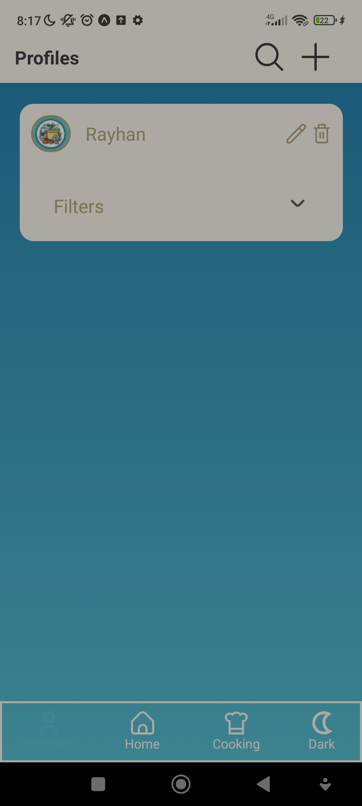
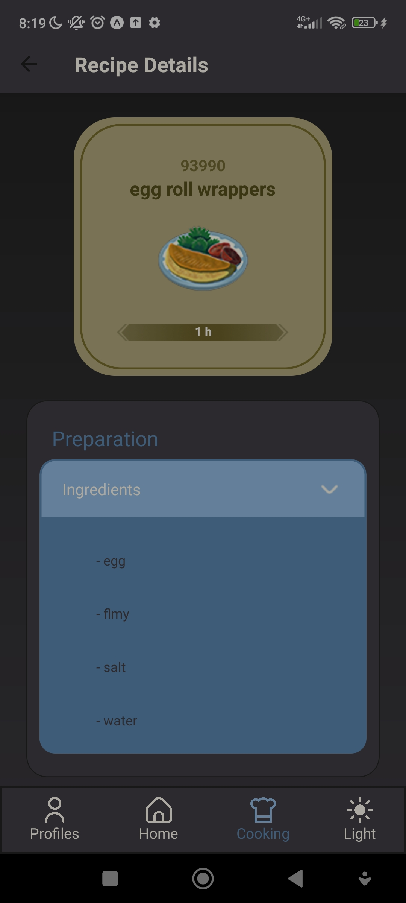

<div align = center>


</div>

**Name of the application** : LeftOvers :pizza:
</br>

**Thème de l’application** : Suggest recipes with available ingredients.
</br>

**What is the application doing?** : 👇

</br>

:information_source: A mobile application (IOS/Android) that enables users to choose ingredients in order to cook. The app will return a list of adapted recipes.

# Git Repository Repartition

The Git root is made of two majors repositories for the project:

[**LeftOvers**](LeftOvers) : **The code part of the application**

[**Images**](Images) : **Application's Images**

👉 [**Application's solution**](LeftOvers/App.tsx)

# How it works?

# Application's Visual Chart

    ## Light Theme

<div align = center>
  
  
  <br/>
  
  
   
</div>

    ## Dark Theme 

<div align = center>
  
  
  <br/>
  
  
  
</div>

# Working Environment

Application's Support :

<div align = center>

---

&nbsp; 
&nbsp; 

</div>


Technologies Used :

<div align = center>

---

&nbsp; 
&nbsp; 
&nbsp; 

</div>

IDE :

<div align = center>

---

&nbsp; 
&nbsp; 
&nbsp; 

</div>

How do we communicate? :

<div align = center>

---

&nbsp; 
&nbsp; 

</div>

Design :

<div align = center>

---

&nbsp; 
&nbsp; 

</div>


# How to test the app
* Clone the repo
* install **expo go** app on your phone
* go to **LeftOvers_App/LeftOvers**
* run ```npm i``` and ```npx expo start```
* scan the QR code in your terminal

**Caution !** You might have issues depending on the network you are using.
For example, it does not work on our IUT network.


# Application Developers and Admins

The team of the project is composed by three students from the Aubière's IUT in Computer Science:
<br>
⚙️ Louison PARANT
<br>
⚙️ Rayhân HASSOU 
<br>
⚙️ Remi REGNAULT 

<div align = center>
© FI Group 2
</div>
